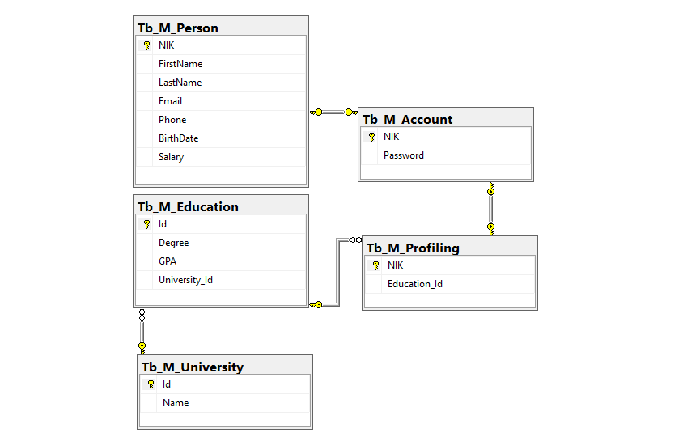
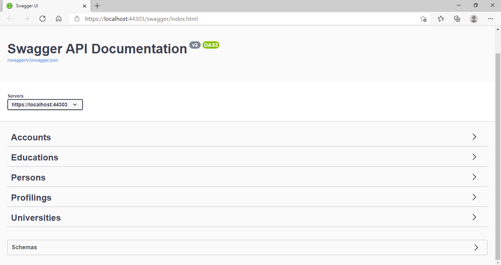

# Week 1
### Day 1: *"Kilas Balik ASP.NET Framework"*
### Day 2: Relationships - EF Core
How to configure relationships between entity types when using Entity Framework Core

### Day 3: Generic Repository Pattern ASP.NET Core Introduction
1. Models (Person, Account, University, Education, Profiling)
2. Repositories
3. Controllers
4. etc.



### Day 4: Lazy Loading Related Data In Entity Framework Core
### Day 5: Swagger API Documentation


How To Add Swagger in ASP.Net Core Using Swashbuckle.AspNetCore NuGet Package for API Documentation
- Open Startup.cs
- Add
```
            services.AddSwaggerGen(options =>
            {
                options.SwaggerDoc("v1",
                    new Microsoft.OpenApi.Models.OpenApiInfo
                    {
                        Title = "Swagger API Documentation",
                        Version = "v1"
                    });
            });
```
and
```
            app.UseSwagger();
            app.UseSwaggerUI(options =>
            {
                options.SwaggerEndpoint("/swagger/v1/swagger.json", "Swagger API Documentation");
		app.UseDeveloperExceptionPage();
            }
            );
```
- Then, you can can `start debugging` or `start without debugging`
- To access it, you can edit url with *yourUrl/swagger/index.html*
- You're amazing!!!